### Know the Word. Build real recall.

An offline-ready whole-Bible learning game with guided progression, adaptive review, structured interactions, and a fully reconstructed **5,799-question canonical bank across all 66 books**.

 

 

**5,799 canonical questions** · **203 structured questions** · **66 books** · **5 difficulty tiers** · **22 collections**

## What awaits you

| 🗺️ **Bible Journey** | ⚡ **Quick Play** | 🧠 **Adaptive Review** |
|:---:|:---:|:---:|
| 25 guided stages from Creation to New Creation | Exact-tier rounds with calibrated Beginner → Expert difficulty | Revisit weak skills with tier-aware Learn, Strengthen, and Recover sessions |

| 📖 **Whole-Bible Library** | 🧭 **Learning Path** | 🎯 **Mastery Tracking** |
|:---:|:---:|:---:|
| Practice all 66 books and explore key passages | 63 routed learning stages with canonical question pools | Track progress by passage, skill, book, stage, and knowledge area |

| 🗂️ **Collections** | 🧩 **Structured Questions** | ⚔️ **Duel** |
|:---:|:---:|:---:|
| 22 curated thematic collections | 203 sequence, chain, timeline, matrix, ladder, and grouping interactions | Five-tier pass-and-play battles with balanced difficulty and real score-based wagering |

## v4.1.0 question bank

The v4.1.0 reconstruction rebuilt the question bank from the ground up for accuracy, difficulty integrity, learning value, and mode consistency.

| Metric | v4.1.0 |
|---|---:|
| Canonical active questions | **5,799** |
| Structured questions | **203** |
| Books covered | **66** |
| Difficulty tiers | **5** |
| Collections | **22** |
| Journey stages | **25** |
| Learning Path stages | **63** |
| Campaign missions | **72** |
| Expedition arcs | **12** |

### Difficulty distribution

| Beginner | Easy | Standard | Advanced | Expert |
|---:|---:|---:|---:|---:|
| **1,338** | **1,668** | **1,132** | **1,140** | **521** |

The original 6,072-question registry is preserved for compatibility, while **273 redundant aliases** are excluded from normal question selection. The playable bank therefore contains 5,799 canonical questions with no remaining exact playable duplicate groups.

The distribution above is the committed P2E successor baseline. See [repository status](docs/TBC_STATUS.md), [preservation invariants](docs/TBC_INVARIANTS.md), and [release commands](docs/TBC_RELEASE_CHECKLIST.md) for verified evidence and limitations.

## Built for focused learning

- **5,799** canonical questions with whole-Bible coverage across all **66 books**
- **203** structured interactions alongside multiple-choice and retrieval-focused play
- Five calibrated difficulty tiers: **Beginner, Easy, Standard, Advanced, Expert**
- Dynamic canonical routing across Quick Play, focused modes, books, Learning Path, Campaign, Expedition, collections, challenges, Bible Reader practice, Adaptive Review, and Duel
- Rich answer feedback with biblical evidence, learning focus, memory cues, and wrong-answer explanations
- Responsive desktop/mobile interface with light/dark themes, reduced-motion support, high contrast, touch controls, and keyboard accessibility
- Automatic local saving, progress export/import, active-session restoration, and offline-ready static deployment
- No account or installation required

> Open the game, choose a mode, and start. Your progress stays in your browser.

### Ready to begin?

<a href="https://thiepn.github.io/tbc"><strong>▶ PLAY THE BIBLE CHALLENGE</strong></a>

Works on desktop and mobile · The Bible Challenge v4.1.0

